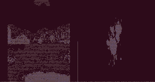
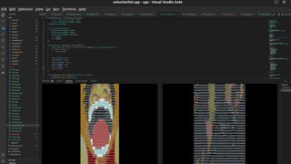
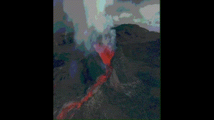
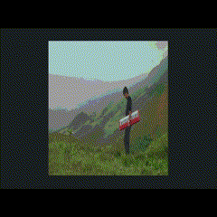
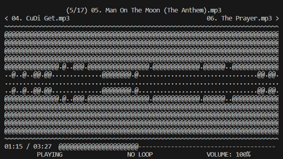

# TMedia


Terminal media player

Written in C++ 17

## Example Output








## Supports

- Playing Audio and Video Files
- Displaying Image files
- Displaying Colored and Grayscale output
- Audio and Video Controls (Seeking, Changing Volume, Muting, Pausing, Looping)
- Playing multiple files
- Reading directories for multiple files to play

## Media Controls

- Video and Audio Controls
  - Space - Play and Pause
  - Up Arrow - Increase Volume 5%
  - Down Arrow - Decrease Volume 5%
  - Left Arrow - Skip Backward 5 Seconds
  - Right Arrow - Skip Forward 5 Seconds
  - Escape or Backspace or 'q' - Quit Program
  - '0' - Restart Playback
  - '1' through '9' - Skip To n/10 of the Media's Duration
  - 'L' - Switch looping type of playback (between no loop, repeat, and repeat one)
  - 'M' - Mute/Unmute Audio
- Video, Audio, and Image Controls
  - 'C' - Display Color (on supported terminals)
  - 'G' - Display Grayscale (on supported terminals)
  - 'B' - Display no Characters (on supported terminals) (must be in color or grayscale mode)
  - 'N' - Skip to Next Media File
  - 'P' - Rewind to Previous Media File

All of these controls can also be seen when calling ascii_video with no args or
with --help

## Dependencies

* [curses](https://invisible-island.net/ncurses/)
* [FFmpeg](https://ffmpeg.org/)
* [cmake](https://cmake.org/)

### Ubuntu/Debian

```bash
sudo apt-get update
sudo apt-get install build-essential cmake pkg-config libavdevice-dev libncurses-dev
```

run these 4 commands in the terminal, starting from
the root of the repository:

```bash
mkdir build
cd build
cmake ../
make -j$(nproc)
```

The file "ascii_video" should appear once the build finishes, and can be
symlinked to an area on your PATH if you want to use it anywhere

On non-Debian/Ubuntu distros, ascii_video's installation is currently untested,
but I don't see why it wouldn't be possible

On Windows, WSL 2 currently has to be used to use ascii_video

## Acknowledgments

Inspiration, code snippets, etc.

* [ncurses 3D renderer](https://github.com/youngbrycecode/RenderEngine)
  * [video-series](https://www.youtube.com/playlist?list=PLg4mWef4l7Qzxs_Fa2DrgZeJKAbG3b7ue)
  * created by [youngbrycecode](https://github.com/youngbrycecode)
* [Coding Video into Text by The Coding Train on Youtube](https://www.youtube.com/watch?v=55iwMYv8tGI)
  * [The Coding Train](https://www.youtube.com/c/TheCodingTrain)
* [How to Write a Video Player in Less Than 1000 Lines](http://dranger.com/ffmpeg/)


