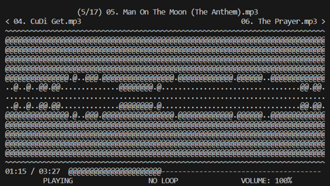

# tmedia


Terminal media player

Written in C++ 17

## Example Output




## Table of Contents

- [Supports](#supports)
- [Media Controls](#media-controls)
- [Installing](#installing)
  - [Dependencies](#dependencies)
  - [Ubuntu/Debian Linux](#ubuntudebian-linux)
- [Bug and Feature Reporting](#bug-and-feature-reporting)
- [Acknowledgements](#acknowledgments)
  - [Bundled 3rd-party libraries](#bundled-3rd-party-libraries)
  - [Inspiration and Resources](#inspiration-and-resources)

## Supports

- Playing Audio and Video Files
- Displaying Image files
- Displaying Colored and Grayscale output
- Audio and Video Controls (Seeking, Changing Volume, Muting, Pausing, Looping)
- Playing multiple files
- Reading directories for multiple files to play

## Media Controls

- Video and Audio Controls
  - Space - Play and Pause
  - Up Arrow - Increase Volume 5%
  - Down Arrow - Decrease Volume 5%
  - Left Arrow - Skip Backward 5 Seconds
  - Right Arrow - Skip Forward 5 Seconds
  - Escape or Backspace or 'q' - Quit Program
  - '0' - Restart Playback
  - '1' through '9' - Skip To n/10 of the Media's Duration
  - 'L' - Switch looping type of playback (between no loop, repeat, and repeat one)
  - 'M' - Mute/Unmute Audio
- Video, Audio, and Image Controls
  - 'C' - Display Color (on supported terminals)
  - 'G' - Display Grayscale (on supported terminals)
  - 'B' - Display no Characters (on supported terminals) (must be in color or grayscale mode)
  - 'N' - Skip to Next Media File
  - 'P' - Rewind to Previous Media File

All of these controls can also be seen when calling tmedia with no args or
with --help


## Installing

### Dependencies

* [curses](https://invisible-island.net/ncurses/) - Terminal Output
* [FFmpeg](https://ffmpeg.org/) - Multimedia decoding, scaling, and resampling
* [cmake](https://cmake.org/) - Building
* [pkg-config](https://www.freedesktop.org/wiki/Software/pkg-config/) - Finding ffmpeg libs

### Ubuntu/Debian Linux

```bash
sudo apt-get update
sudo apt-get install git build-essential cmake pkg-config libavdevice-dev libncurses-dev
```

Next, clone this repository to your desired directory with

```bash
git clone https://github.com/cobyj33/tmedia.git
```

run these 4 commands in the terminal, starting from
the root of the repository:

```bash
mkdir build
cd build
cmake ../
make -j$(nproc)
```
The file "tmedia" should appear once the build finishes, and can be
symlinked to an area on your PATH if you want to use it anywhere

## Windows

Currently for windows, WSL 2 running Debian/Ubuntu must be used to run tmedia.

After running WSL 2 with Debian/Ubuntu Linux, you can follow the installation
directions under [Ubuntu/Debian Linux](#ubuntudebian-linux)

> Currently, anything outside of Ubuntu/Debian is not tested. That being said,
> if you have the libav libraries from FFmpeg and the curses libraries available, 
> building tmedia should still work with all dependencies. If you need help with this,
> I'll be happy to help in an issue.

## Bug and Feature Reporting

If there are any problems with installing or using tmedia, or any requested feature,
please leave an issue at the [github repo](https://www.github.com/cobyj33/tmedia)
and I'll be sure to help. 

## Acknowledgments

### Bundled 3rd-party libraries

* [miniaudio](https://miniaud.io/) - Cross-platform audio playback ([github](https://github.com/mackron/miniaudio))
* [Natural Sort](https://github.com/scopeInfinity/NaturalSort) - Natural Sorting and Comparison: For sorting directory files

### Inspiration and Resources

* [ncurses 3D renderer](https://github.com/youngbrycecode/RenderEngine)
  * [video-series](https://www.youtube.com/playlist?list=PLg4mWef4l7Qzxs_Fa2DrgZeJKAbG3b7ue)
  * created by [youngbrycecode](https://github.com/youngbrycecode)
* [Coding Video into Text by The Coding Train on Youtube](https://www.youtube.com/watch?v=55iwMYv8tGI)
  * [The Coding Train](https://www.youtube.com/c/TheCodingTrain)
* [How to Write a Video Player in Less Than 1000 Lines](http://dranger.com/ffmpeg/)


